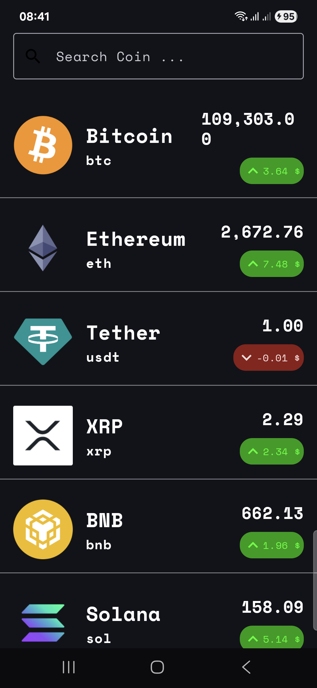
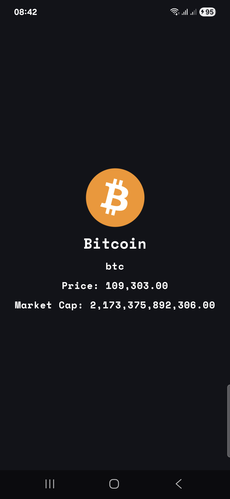
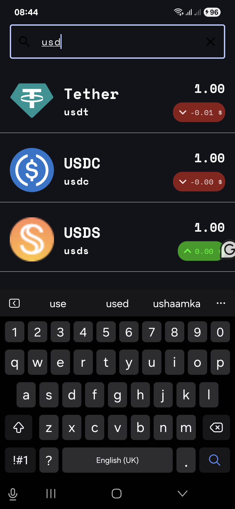

## CoinTracker Pro
CoinTracker Pro is an android application that utilizes the [CoinGecko API](https://www.coingecko.com/en/api), allowing users to view a comprehensive list of cryptocurrencies, dive into their intricate details, and quickly search for specific coins. 

- Coin list screen.

- Coin details screen.

- Search Coin

## Tech Stack
- Language: Kotlin
- UI: Jetpack Compose
- Networking: Ktor
- DI: Koin
- Coroutines: For asynchronous tasks
- Coil: Image Loading
